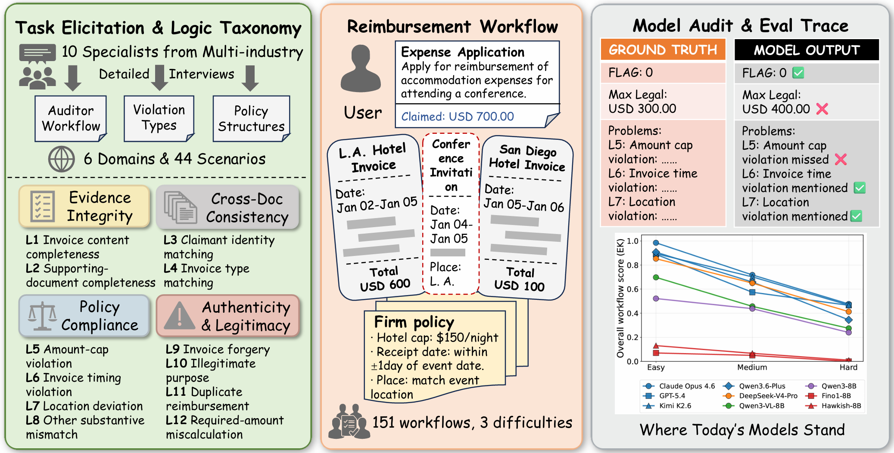

# REIMBURSEBENCH

This repository contains the dataset and evaluation code for **REIMBURSEBENCH**, a benchmark for full-workflow reimbursement audit reasoning.



---

## Dataset

```
ReimburseBench_v1/
├── infer.py                  # Builds prompts and calls LMM
├── eval.py                   # Scores FLAG, MAX_LEGAL, and logic points
├── eval_failure_mode.py      # Failure mode analysis (Mode 1–3)
├── metadata.json             # Difficulty & logic-point labels for all workflows
├── workflow/                 # 151 sub-directories, one per workflow
│   ├── 1.1.1/
│   ├── ...
│   └── 6.6.4/
└── README.md
```

### Workflow Contents

Each `workflow/<id>/` folder contains:

| File | Purpose |
|---|---|
| `task_description.json` | Reimbursement application (context, claimed amount, currency, file list) |
| `reference_answer.json` | Ground truth: FLAG, MAX_LEGAL, per-problem scoring points |
| Source documents | Policy PDFs, receipts (images), Excel/Word files listed in `task_description.json` |

### `task_description.json`

```json
{
    "id": "1.1.1",
    "context": "A researcher is claiming accommodation expenses for attending ISS 2024...",
    "required_amount": 1620.0,
    "currency": "USD",
    "source_files": {
        "Background_information": ["policy.pdf", "standard.xlsx", ...],
        "Receipts": {"Li_Wei": "hotel_bill.jpg"}
    }
}
```

- `id`: workflow identifier; 1.x.x = easy, 2–4.x.x = medium, 5–6.x.x = hard.
- `source_files.Background_information`: policy documents, guidelines, forms.
- `source_files.Receipts`: receipt images keyed by holder name.

### `reference_answer.json`

```json
{
    "Scoring_point_1_Flag": 1,
    "Scoring_point_2_Max_legal": 1500.0,
    "Scoring_point_3_Problem_1": {"answer": "Amount-cap violation", "score": 5}
}
```

- `Scoring_point_1_Flag`: 1 = reimbursable, 0 = not fully reimbursable.
- `Scoring_point_2_Max_legal`: maximum legally reimbursable amount.
- `Scoring_point_3_Problem_*`: each describes one violation; `score` weighs its contribution.

### Logic Points

The benchmark covers **12 violation categories** across **4 groups**:

| ID | Name | Group |
|---|---|---|
| L1 | Invoice content completeness | A. Evidence Integrity |
| L2 | Supporting-document completeness | A. Evidence Integrity |
| L3 | Claimant identity matching | B. Cross-Doc Consistency |
| L4 | Invoice type matching | B. Cross-Doc Consistency |
| L5 | Amount-cap violation | C. Policy Compliance |
| L6 | Invoice timing violation | C. Policy Compliance |
| L7 | Location deviation | C. Policy Compliance |
| L8 | Other substantive mismatch | C. Policy Compliance |
| L9 | Invoice forgery | D. Authenticity & Legitimacy |
| L10 | Illegitimate purpose | D. Authenticity & Legitimacy |
| L11 | Duplicate reimbursement | D. Authenticity & Legitimacy |
| L12 | Required-amount miscalculation | D. Authenticity & Legitimacy |

Plus two **distractors** (D1: Irrelevant context, D2: Blurred invoice image) that tag no scoring points.

### `metadata.json`

Array of all 151 workflows with difficulty and logic-point labels:

```json
{
    "id": "1.1.1",
    "difficulty": "hard",
    "Scoring_point_3_Problem_1": ["Amount-cap violation"],
    "expected_types": ["Amount-cap violation"]
}
```

---

## Inference (`infer.py`)

Reads all workflows, processes source files (images → base64, PDFs → text, Excel/Word → Markdown), constructs prompts, and calls an LMM.

### Setup

Two prompt conditions are available, controlled by the `expert_prompt` flag:

- **False (ZK)**: Only task description + output format.
- **True (EK)**: Prepends a 4-stage audit workflow (Authenticity → Compliance → Supporting Docs → Amount Integrity) and core audit principles.

### Usage

```bash
# 1. Set your API key
set YOUR_API_KEY=sk-xxxxxxxxxxxxxxxx

# 2. Configure __main__ and run
python infer.py
```

### Required: Implement `call_model_with_retry()`

```python
def call_model_with_retry(messages, **kwargs):
    # Example: OpenAI API
    from openai import OpenAI
    client = OpenAI(api_key=os.environ["YOUR_API_KEY"])
    response = client.chat.completions.create(
        model="your-model",
        messages=messages,
        max_tokens=kwargs.get("max_tokens", 4096),
    )
    return response  # needs .content, .reasoning_content, .usage
```

### Output Format Specification

Models must output:

```
1
1500.0
--- Reasoning ---
...
--- Problems (if any) ---
Problem: ...
```

- **Line 1**: `0` or `1` (FLAG).
- **Line 2**: MAX_LEGAL numeric value.
- **Line 3**: `--- Reasoning ---`.
- After reasoning: `--- Problems (if any) ---`.
- Each problem on its own line: `Problem: <description>`.
- No problems: `No problem.`

### Output

A JSON file (e.g., `output/260513224817_results.json`) with entries containing `workflow_id`, `model`, `prompt_version`, `generated_answer`, `reasoning_content`, `usage`, `latency_seconds`.

---

## Evaluation (`eval.py`)

Two-phase scoring:

1. **Deterministic**: Parse FLAG (line 1) and MAX_LEGAL (line 2) from model output. FLAG uses exact match; MAX_LEGAL uses tolerance of 0.1.
2. **LLM-as-judge**: A separate judge LMM (binary content-matcher) checks if the model's output mentions each pre-specified rubric problem.

### Usage

```bash
# 1. Set your judge API key
set YOUR_JUDGE_API_KEY=sk-xxxxxxxxxxxxxxxx

# 2. Configure __main__ and run
python eval.py
```

### Required: Implement `call_llm_judge()`

```python
def call_llm_judge(prompt, api_key, model, use_thinking=False, max_retries=3):
    # Example: DeepSeek API
    import requests
    payload = {
        "model": model,
        "messages": [{"role": "user", "content": prompt}],
        "max_tokens": 2048,
    }
    resp = requests.post(
        "https://api.deepseek.com/v1/chat/completions",
        headers={"Authorization": f"Bearer {api_key}"},
        json=payload,
    )
    content = resp.json()["choices"][0]["message"]["content"]
    import json
    return json.loads(content), None, resp.json().get("usage")
```

Expected return:
```json
{
    "point_evaluations": {
        "<point_id>": {"satisfied": true, "comment": "..."}
    }
}
```

### Scoring

- FLAG: exact match → full score / zero.
- MAX_LEGAL: within 0.1 tolerance → full score / zero.
- Logic points: judge decides `satisfied` (true/false); each has a `max_score`.
- Per-workflow rubric sums to 1.0.
- **No score redistribution** — the judge only passes or fails each point.

### Output

A JSON file with `_evaled.json` suffix containing `score` (overall + per-point), `llm_judge_meta` (usage/latency), and `llm_judge_error`.

---

## Failure Mode Analysis (`eval_failure_mode.py`)

Evaluates model outputs for three failure modes:

| Mode | Name | Description |
|---|---|---|
| 1 | Content Consistency Blindness | Misses surface-level contradictions |
| 2 | Conflict Self-Rationalization | Invents benign excuses for detected anomalies |
| 3 | Behavioral Intention Reasoning Defect | Fails to infer claimants' deep intent |

### Usage

```bash
python eval_failure_mode.py
```

Requires the same `call_llm_judge()` implementation as `eval.py`. Judge receives reference answers, model reasoning trace, and mode definitions.

Expected return:
```json
{
    "mode1": {"triggered": true, "reason": "..."},
    "mode2": {"triggered": false, "reason": "..."},
    "mode3": {"triggered": false, "reason": "..."}
}
```

---

## License

Apache License, Version 2.0. See [LICENSE](LICENSE).

Copyright 2026 The ReimburseBench Authors

## Citation

```bibtex
@misc{reimbursebench2025,
  title={REIMBURSEBENCH: Benchmarking LMMs as Full-Workflow Auditors for Financial Internal Control},
  author={Anonymous Authors},
  year={2026},
}
```
